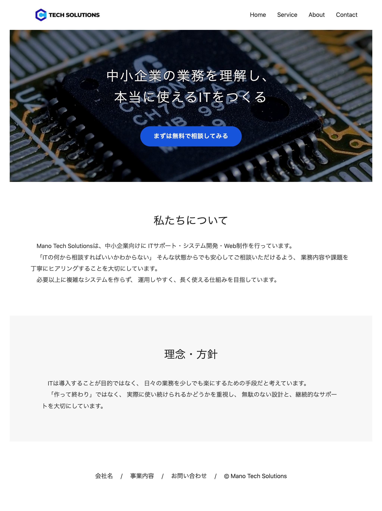

# IT企業コーポレートサイト（ポートフォリオ）

企業情報をわかりやすく伝えることを目的として制作しました。
架空のIT企業「Mano Tech Solutions」のコーポレートサイトです。

---

## URL

https://github.com/ManoTakafumi/IT-lp

---

## 制作背景
就職活動用のポートフォリオとして、
「企業の魅力をわかりやすく伝えるWebサイト」をテーマに制作しました。

実務を想定し、以下を意識しています。

- ユーザーにとって見やすい構成
- 必要な情報がすぐに見つかる導線設計
- シンプルで伝わりやすいデザイン

---

## 想定ユーザー

- IT企業に興味のある求職者
- 企業情報を知りたい一般ユーザー

---

## 使用技術
- HTML(構造設計)
- CSS(レイアウト・デザイン)
- JavaScript(Hamburger menu,Header)
- Git/GitHub

---

## 主なページ構成
- トップページ(home.html)
- 会社概要(about.html)

---

## 工夫した点

- 情報の優先度を考えた見やすいレイアウト設計
- 無駄なものできるだけ省いた視認性重視のデザイン
- タブレット用レスポンシブデザイン

---

## 今後の改善点

- レスポンシブ対応(スマートフォン用)
- フォームの実装(バックエンド連携)
- アニメーションなどの追加によるUX向上

---
## スクリーンショット

### トップページ(home.html)

### 会社概要(about.html)

---

